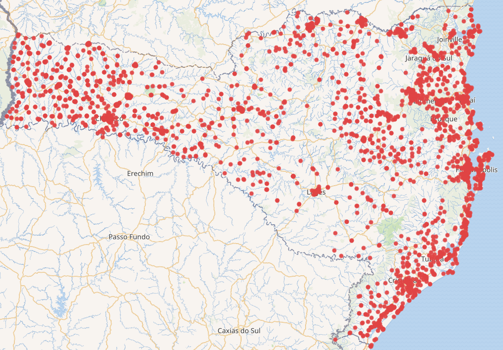

  

<h1 align="center">📚 Projeto NBAP Wikidata na Escola – Mapeando Escolas de Santa Catarina na Wikidata</h1>

Utilizando o Censo Escolar para mapear todas as escolas na <b>WikiData</b>.

---

## 📝 Introdução
Nosso trabalho teve como foco dar **Representatividade** as escolas de Santa Catarina na Wikidata, uma plataforma global de dados estruturados e colaborativa. Por não haver muitas escolas cadastradas na WikiData, era difícil fazer análises abertas sobre a educação básica, a partir disso, surgiu a proposta desse projeto (sendo filho de um projeto maior), automatizando com os dados do Censo Escolar e a programação em **Python** e **SPARQL**

## 🎯 Objetivos
Criar escolas na Wikidata, nas quais não existiam, utilizando-se desses passos:
  - Extrair e tratar os dados a partir de um arquivo fonte (Censo Escolar), garantindo a qualidade e consistência das informações.
  - Verificar se cada instituição existe na Wikidata por meio de consultas em SPARQL, a fim de evitar duplicidades.
  - Criar novos itens no Wikidata para as escolas não encontradas

## 🛠️ Metodologia
O projeto foi feito concluindo esses quatro passos principais:
  1. **Capacitação** – Foi realizada oficinas online e presenciais para introduzir a Wikidata, Python, SPARQL e o conceito dos dados estruturados aos alunos do projeto.
  2. **Coleta de Dados** – Extração dos microdados do **Censo Escolar de 2023**, filtrando as informações importantes de cada instituição. 
  3. **Programação** – Desenvolvimento e execução do script em Python para automatizar a criação de itens no Wikidata, por meio deste repositório.  
  4. **Escrita do resumo** – Após o fim da etapa anterior, foi escrito um resumo, pelos próprios alunos, refletindo sobre o trabalho feito e sistematizando sobre os resultados.

## 📊 Resultados
Foram criadas 6.590 instituições na Wikidata, desde escolas municipais, estaduais, quilombolas, rurais e privadas, contendo dados de **Saneamento Básico**, **Tratemento de lixo** e **Tipo de energia elétrica**
O projeto mostrou que a Wikidata foi mais interativa que vários sites governamentais (Exemplos: Educação na Palma da Mão, Tribunal de Contas do Estado de Santa Catarina - TCE/SC)

  

Todas as escolas de Santa Catarina, nas quais não tem acesso a rede de esgoto.
(Veja a consulta em https://w.wiki/FCPs)

## 🛠 Explicando o Repositório

- **Main.py:** Esse arquivo é um mediador, uma ponte entre criar escolas e editar-as informações delas na Wikidata, ele analisa o arquivo do Censo Escolar e com base no código INEP, consulta se a mesma existe.
Se existe, ele cria, se não, verifica.

- **createNewSchool.py e editSchool.py:** Simples, eles contem funções que criam e editam funções respectivamente.
  
- **Pasta Dados:** Aqui estão todos os dados do Censo Escolar 2023 divididos em lotes, pois cada estudante enviou um de cada vez pelo seu proprio computador.

## 📚 Referências

1. BRASIL. Instituto Nacional de Estudos e Pesquisas Educacionais Anísio Teixeira. *Censo escolar da educação básica 2023: microdados*. Disponível no: [link](https://www.gov.br/inep/pt-br/acesso-a-informacao/dados-abertos/microdados/censo-escolar). Acesso em: 8 ago. 2025.  

2. OUTREACH DASHBOARD. *Wikidata na Escola*. Disponível no: [link](https://outreachdashboard.wmflabs.org/courses/EEB_Prof._Nicola_Baptista/Wikidata_na_Escola/home). Acesso em: 8 ago. 2025.  

3. SAMPAIO, R.C.; SABBATINI, M.; LIMONGI, R. *Diretrizes para o uso ético e responsável da Inteligência Artificial Generativa: um guia prático para pesquisadores*. São Paulo: Editora Intercom, 2024.  

4. SANTA CATARINA. *Educação na Palma da Mão*. Disponível no: [link](https://www.sed.sc.gov.br/educacao-na-palma-da-mao/). Acesso em: 8 ago. 2025.  

5. TRIBUNAL DE CONTAS DE SANTA CATARINA. *Painel de Infraestrutura das Escolas Catarinenses*. Disponível no: [link](https://tcesc.shinyapps.io/painelinfraestrutura/). Acesso em: 8 ago. 2025.  

6. WIKIDATA. *Introduction*. Disponível no: [link](https://www.wikidata.org/wiki/Wikidata:Introduction). Acesso em: 8 ago. 2025.  
